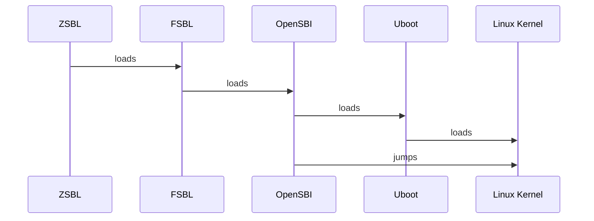
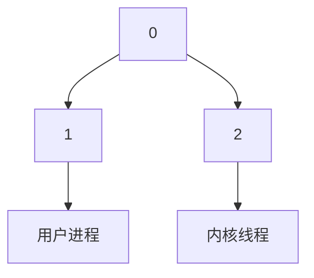

# 跟踪分析 Linux 内核的启动过程

## 下载RISC-V工具链

对于新手而言，自己克隆RISC-V的仓库进行编译有三大不方便之处：

1. RISC-V工具链仓库巨大，对于国内用户下载不方便
2. RISC-V工具链的依赖包和配置，新手不一定能解决
3. RISC-V工具链编译时间长

故此，使用他人编译好的工具链，是一种有效的方式。网站 [toolchains.bootlin.com](https://toolchains.bootlin.com/) 提供了已经编译好的RISC-V工具链，如下图所示：


选项：

- 在Select arch选项中，我们选择riscv64-lp64d

- 在Select libc中选择glibc
- 下载stable版或者Bleeding-edge

本节以下载Bleeding-edge为例。首先使用以下的命令在~目录下创建一个名为的目录：

```bash
mkdir riscv64_oslab
cd riscv64_oslab
```

下载之后使用以下的命令进行解压：

```bash
wget https://toolchains.bootlin.com/downloads/releases/toolchains/riscv64-lp64d/tarballs/riscv64-lp64d--glibc--bleeding-edge-2023.08-1.tar.bz2

tar -jxvf riscv64-lp64d--glibc--bleeding-edge-2023.08-1.tar.bz2
```

解压之后，使用你喜欢的编辑器打开位于~目录下的.bashrc或者.zshrc设置工具链的环境变量，下面将使用emacs在zsh下设置工具链的环境变量：

```bash
emacs ~/.zshrc
```

在.zshrc中添加以下语句：

```bash
export PATH=/home/elon/riscv64_oslab/riscv64-lp64d--glibc--bleeding-edge-2023.08-1/bin:$PATH
```

需要注意的是/home/elon/需要更换为自己的用户名，在riscv64_oslab/riscv64-lp64d--glibc--bleeding-edge-2023.08-1/bin目录中可使用pwd命令显示自己需要添加的路径。


## 安装QEMU

qemu是一个开源且免费的硬件虚拟化仿真器，可以提供不同的虚拟的计算机架构。我们使用qemu在x86平台上模拟rsicv架构的裸机用于调试和测试linux内核。

在riscv64_oslab目录下使用以下的命令可以下载和解压qemu：

```bash
wget https://download.qemu.org/qemu-7.1.0.tar.xz
tar xvJf qemu-7.1.0.tar.xz
```

解压后使用以下命令进行配置和编译以及安装：

```bash
cd qemu-7.1.0
./configure
make -j$(nproc)	
make install
```

其中make -j$(nproc)中的-j$(nproc)参数为以机器硬件线程数进行多线程编译。


## 编译OpenSBI

SBI是RISC-V架构下的特权层二进制接口，是用于引导程序环境的规范。通俗的讲就是x86下的bios,但这并不准确，如果想要详细了解什么是OpenSBI，可以参考这个链接[OpenSBI Deep Dive](https://riscv.org/wp-content/uploads/2019/06/13.30-RISCV_OpenSBI_Deep_Dive_v5.pdf)。OpenSBI的英文全称是[RISC-V Open Source Supervisor Binary Interface ](https://github.com/riscv-software-src/opensbi#risc-v-open-source-supervisor-binary-interface-opensbi)。我们使用OpenSBI引导linux内核的加载。

使用以下的命令在riscv64_oslab目录下克隆OpenSBI：

```bash
git clone https://github.com/riscv-software-src/opensbi.git
```

使用以下命令进行编译：

```bash
export CROSS_COMPILE=riscv64-linux-
make PLATFORM=generic -j$(nproc)	
```

最后生成的OpenSBI固件在`build/platform/generic/firmware/`目录下产生：


生成的目录下有三个关键词需要解释：

- dynamic:带有动态信息的固件
- jump:指定下一级的boot地址跳转
- payload:包含下一级boot的二进制内容，通常是uboot/linux

为了减少工作量，我们不编译uboot，所以我们选择jump关键字的固件--`fw_jump.elf`.

下图演示了，我们启动Linux内核的次序，与常规方式不同的在于我们使OpenSBI直接jumps跳到Linux Kernel的启动处。



## 编译Linux Kernel

由于Linux Kernel在6.0的版本后使用了rust语言进行了编写，为了减少不必要的麻烦和意外，我们使用的Linux内核版本小于v6.0。

使用以下命令在riscv64_oslab目录下下载和解压Kernel:

```bash
wget http://mirrors.besti.net/kernel/v5.x/linux-5.19.16.tar.xz
tar -xf linux-5.19.16.tar.xz
cd linux-5.19.16
```

需要注意的是我们使用了电科院的内部Linux Kernel的镜像网站进行下载，读者需要自己的寻找国内的镜像。

解压之后，需要指定编译Linux Kernel的架构和方式。为了编译出RISC-V架构的Linux内核，我们需要指定编译为RISC-V的架构，同时由于我们是在X86的平台上进行编译，所以我们必须使用交叉编译的方式进行编译。命令如下：

```bash
export ARCH=riscv
export CROSS_COMPILE=riscv64-linux-

make defconfig
```

使用`make defconfig`后Linux内核目录下会产生一个.config文件，为了方便后面的使用GDB调试RISC-V版本的Linux内核，我们需要为我们编译的内核附加上调试信息。我们需要修改Linux内核目录下的Makefile文件，这里依旧使用emacs进行修改，读者请使用自己喜好的编辑器修改。

```bash
emacs Makefile
```

在emacs中使用`Ctrl+s` 粘贴`KBUILD_CFLAGS`按下回车，找到`KBUILD_CFLAGS`的位置，在后面的选项中加入`-g`。例如图下：


此举是为了提供GDB调试的功能。修改完成后保存即可退出，进行最后的编译：

```bash
make -j$(nproc)	
```

编译完成后将在两个地方生成文件。一处就在在linux内核目录下，另一处在linux内核目录下的arch/riscv/boot/，如图所示：

第一处：


第二处：


## 制作根文件系统

一般一个简易的Linux操作系统包括两个部分，一个是Linux Kernel，另一个是根文件系统。制作根文件系统通常有两个工具可以使用，一种是BusyBox，另一种是Buildroot。使用BusyBox制作根文件系统的步骤较多,但是很灵活。而Buildroot操作简单。

首先在riscv64_oslab目录下下载和解压buildroot：

```bash
wget https://buildroot.org/downloads/buildroot-2023.02.6.tar.gz
 tar -xvf buildroot-2023.02.6.tar.gz
```

解压后进入buildroot目录进行buildroot配置：

```bash
cd buildroot-2023.02.6
make menuconfig
```

使用上述命令将出现一个菜单界面。

首先，进入Target options。


选择Target Architecture为RISCV。


Exit返回一级界面后，选择Filesysem images后选择ext2/3/4 root filesystem。


保存后使用以下命令进行编译：

```bash
make -j$(nproc)	
```

本次编译由于buildroot需要编译自己的编译需要的工具链，因此时间较长，请读者耐心等待。编译完成后，在`output/images`目录下将生成我们需要的文件。


至此，漫长的编译过程已经结束了。下一节，我们将运行自己制作的一个简易linux操作系统和进行GDB远程调试内核，从start_kernel到init进程启动。

## 运行简易Linux内核

使用以下命令在riscv64_oslab目录创建images目录：

```
mkdir images
```

使用以下命令在images目录下将之前各个部分的编译好的文件复制到images目录下：

```bash
cp ../opensbi/build/platform/generic/firmware/fw_jump.elf .
cp ../linux-5.19.16/vmlinux .
cp ../linux-5.19.16/arch/riscv/boot/Image .
cp ../buildroot-2023.02.6/output/images/rootfs.ext2 .
```

复制完后images目录下将产生以下文件：


现在需要编译一个名叫start-qemu.sh的shell脚本。

使用你喜欢的编辑器打开start-qemu.sh，填写下以下内容。这里仍然使用emacs作为示例：

```bash
emacs start-qemu.sh
```

内容如下：

```shell
#!/bin/sh

qemu-system-riscv64 -M virt \
-bios fw_jump.elf \
-kernel Image \
-append "rootwait root=/dev/vda ro" \
-drive file=rootfs.ext2,format=raw,id=hd0 \
-device virtio-blk-device,drive=hd0 \
-netdev user,id=net0 -device virtio-net-device,netdev=net0 -nographic
```

使用以下命令给`start-qemu.sh`赋予执行权：

```bash
chmod +x start-qemu.sh
```

使用以下命令即可运行简易的RISC-V架构的简易Linux操作系统：

```bash
./start-qemu.sh
```

启动界面如下：


加载完后显示用户登录：


输入`root`点击回车，进入shell。


## 从start_kernel到init进程启动

上节，我们已经完成了在qemu上运行一个简易的RISC-V架构的Linux操作系统。这一节，将对这个Linux内核进行调试。

使用你喜欢的编辑器创建 `start-gdb.sh` shell脚本，按照惯例，笔者依旧使用emacs。

```bash
emacs ./start-gdb.sh
```

脚本内容如下：

```bash
qemu-system-riscv64 -M virt \
                    -bios fw_jump.elf \
                    -kernel Image \
                    -append "rootwait root=/dev/vda ro" \
                    -drive file=rootfs.ext2,format=raw,id=hd0 \
                    -device virtio-blk-device,drive=hd0 \
                    -netdev user,id=net0 -device virtio-net-device,netdev=net0 \
                    -nographic \
                    -s -S
```

保存后，使用以下的命令对`start-gdb.sh`赋予执行权：

```bash
chmod +x ./start-gdb.sh
```

使用以下命令安装 `gdb-multiarch` 为接下来的调试做准备：

```bash
sudo apt install gdb-multiarch
```

现在我们开始正式调试RISC-V架构的Linux内核。

首先在images目录下使用以下命令，启动qemu并开启远程调试：

```bash
./start-gdb.sh
```

然后打开另一个终端，进入imags目录后使用以下命令进入gdb：

```bash
 gdb-multiarch ./vmlinux
```

进入gdb后显示：`Reading symbols from ./vmlinux...` 说明操作正常，可以进一步操作：


现在在gdb内输入以下命令后回车：

```gdb
target remote:1234
```

此举是为了建立gdb和在qemu中启动的gdbserver之间的连接。连接完毕后显示如下：


说明建立连接成功。

现在使用以下命令gdb对`start_kernel`进行打断点：

```gdb
break start_kernel
```

gdb显示`start_kernel`函数在init/main.c文件中。


使用`c`命令让程序执行到`start_kernel`断点处：


现在使用`l`命令显示`start_kernel`断点处：


`l`命令显示`start_kernel`函数位于`init/main.c`中的930行。

在Linux 内核的进程树中，涉及到三个重要的进程，分别是 `0号进程` 和 `1号进程` 以及 `2号进程` 。示意图如下所示：



 `0号进程` 是通过手动创建的，在 `start_kernel` 中出现的 `&init_task` 就是 `0号进程` 的进程描述符。

接下来，让我们先使用编辑器打开linux-5.19.16中init目录中的main.c文件找到`asmlinkage __visible void __init __no_sanitize_address start_kernel(void)`。让我们一起阅读`start_kernel`函数的Linux内核源码。

在这部分的源码中的1138行，也就是`start_kernel`函数的倒数第二个函数，有一个名叫 `arch_call_rest_init()` 的函数。 `arch_call_rest_init()` 的定义如下：

```c
void __init __weak arch_call_rest_init(void)
{
	rest_init();
}
```

我们在gdb中不断使用`n`命令，当next到了 `arch_call_rest_init` 时， 内核即将创建 `kernel_init` 1号进程和 `kthreadd` 2号进程。


使用 `b rest_init` 对 rest_init()函数进行打断点，进入 rest_init 函数后如下：


此时执行下一步会出现调用 `user_mode_thread `， 此时这个函数就是创建 `1号进程`，而 `1号进程` 也被称为 `init` 进程 。继续向下单步执行, 会发现调用 `kernel_thread` ，这个函数就是用于创建 `2号进程`  ，即内核线程。

此时再使用`c`命令，将完成Linux Kernel引导，系统进入登录界面：


至此调试结束。

`start-kernel` 函数中包括了内核的初始化和一系列的设置，包括文件系统、调度器、定时器、内存管理、锁初始化、内存加密、NUMA 策略、ACPI 初始化等等。而 `rest_init` 函数宣告了初始化的结束。