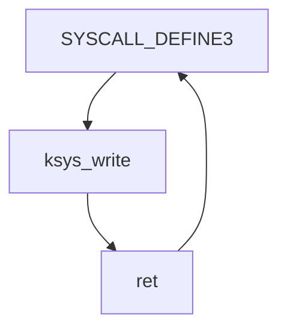

# 分析 system_call 中断处理过程

## MenuOS迁移到RISC-V架构

[MenuOS](https://github.com/mengning/menu/tree/master) 是接下来四次实验的平台。但是由于MenuOS原本设计是为x86架构所服务的，如果需要在RISC-V架构上的机器上运行，就必须对关键部分的汇编代码进行修改。

首先使用以下命令克隆[MenuOS](https://github.com/mengning/menu/tree/master)：

```bash
cd ~/riscv64_oslab/
mkdir MenuOS
cd MenuOS
git clone https://github.com/mengning/menu.git
```

克隆后，进入menu目录，使用你喜欢的编辑器对其中的TimeAsm函数进行修改，修改内容如下：

```c
int TimeAsm(int argc, char *argv[])
{
    time_t tt;
    struct tm *t;
    asm volatile(
        "li a0,201\n\t"
        "ecall \n\t"
        "sd a0, %0\n\t"
        : "=m" (tt)
     );
    t = localtime(&tt);
    printf("time:%d:%d:%d:%d:%d:%d\n",t->tm_year+1900, t->tm_mon, t->tm_mday, t->tm_hour, t->tm_min, t->tm_sec);
    return 0;
}
```

另外一个需要修改的文件是Makefile，这个文件的修改非常重要，将决定产生的什么架构的执行文件。

同样，请使用你喜欢的编辑器，打开Makefile，将其修改为以下内容：

```makefile
#
# Makefile for Menu Program
#

CC_PTHREAD_FLAGS			 = -lpthread
CC_FLAGS                     = -c 
CC_OUTPUT_FLAGS				 = -o
CC                           = riscv64-linux-gcc
RM                           = rm
RM_FLAGS                     = -f

TARGET  =   test
OBJS    =   linktable.o  menu.o test.o

all:	$(OBJS)
	$(CC) $(CC_OUTPUT_FLAGS) $(TARGET) $(OBJS) 
rootfs:
	riscv64-linux-gcc -o init linktable.c menu.c test.c  -static -lpthread
	riscv64-linux-gcc -o hello hello.c -static
	find init hello | cpio -o -Hnewc |gzip -9 > ../rootfs.img
	qemu-system-riscv64 -M virt \
			    -kernel ../linux-5.19.16/arch/riscv/boot/Image \
		        -initrd ../rootfs.img \
                -nographic
.c.o:
	$(CC) $(CC_FLAGS) $<

clean:
	$(RM) $(RM_FLAGS)  $(OBJS) $(TARGET) *.bak
```

需要注意的是，本次实验需要使用 `qemu-system-riscv64` 和 `qemu-system-riscv64` , 请完成第三次实验后，再来做此次实验。

使用以下命令进行编译和运行：

```bash
make -j$(nproc)
make rootfs -j$(nproc)
```

成功运行后，将会显示以下信息：


## CWrite和的编写

现在我们在menu目录下, 使用你喜欢的编辑器修改test.c。这里使用神之编辑器emacs进行修改。

```bash
emacs test.c
```

打开之后，添加以下内容：

CWrite函数内容如下：

```C
int CWrite(void){
  char s[]="hello, world\n";
	write(1,s,13);
	return 0;
  return 0;
}
```

WriteAsm函数如下：

```c
int WriteAsm(void){
  char s[] = "hello, world\n";

    __asm__ volatile(
		    "li a2, 13\n"
		    "li a0, 1\n"
		    "mv a1, %[str]\n"
	    	    "li a7, 64\n"
		    "ecall \n"
		    :
		    : [str] "r" (s)
    );
  return 0;
}
```

同样使用以下命令进行编译和运行：

```bash
make -j$(nproc)
make rootfs -j$(nproc)
```

启动MenuOS后：

输入 `help` 后回车，显示如下信息：


再次输入 `write` 后回车，MenuOS输出以下信息：


输入 `write-asm` 后回车，MenuOS输出以下信息：


## GDB调试sys_write函数

使用你喜欢的编辑器在menu目录下，编写`start-gdb.sh` ，这里依旧使用emacs。

`start-gdb.sh` 的内容如下：

```shell
#!/bin/sh

qemu-system-riscv64 -M virt \
			    -kernel ../linux-5.19.16/arch/riscv/boot/Image \
		        -initrd ../rootfs.img \
                -nographic \
                -s -S
```

使用以下命令赋予`start-gdb.sh` 执行的权限：

```bash
chmod +x start-gdb.sh
```

使用以下命令启动 `start-gdb.sh`：

```bash
./start-gdb.sh
```

启动后，shell中应当不显示任何内容，如下所示：


另开一个终端，进入MenuOS的目录下，使用以下命令启动 `gdb-multiarch ` 。

```bash
gdb-multiarch linux-5.19.16/vmlinux
```

启动之后，输入 `target remote:1234` 建立连接，显示如下信息说明连接建立完成：


依次使用以下命令进行 `sys_write` 的调试：

```gdb
b sys_write
c
layout split
```

最终界面将显示如下信息：


此时，将启动 `gdb-multiarch` 的终端和启动 `./start-gdb.sh` 的终端分别分屏左右，方便查看调试过程中的程序的输出，如下图所示：


执行上面打断点的操作后，在右侧图中的的最后一行显示：`[    0.507884] Run /init as init process` 说明Linux 内核已经初始化完成。
现在使用 十一次 `c` 命令，使得MenuOS加载到shell，如下图所示：


现在在MenuOS中输入 ` write-asm` 回车之后, MenuOS将会暂停输出。然后在左侧gdb窗口中输入命令 `c` ，MenuOS将会显示以下信息：


开始调试 `WriteAsm` 函数，使用 `si` 命令后，程序停留在 `SYSCALL_DEFINE3` 的函数中的返回语句 `return ksys_write(fd, buf, count); ` ，如下图所示：


继续使用 `si` 命令，将程序将执行下一条汇编语句，如下图所示：


基本上调用过程如下：



程序先执行到 ` SYSCALL_DEFINE3` 函数， 然后调用唯一的返回语句中的 `ksys_write` 函数， 之后执行 `ksys_write` 函数的内容，最后返回到 `SYSCALL_DEFINE3` 函数

## system_call 中断分析（王瑞）

