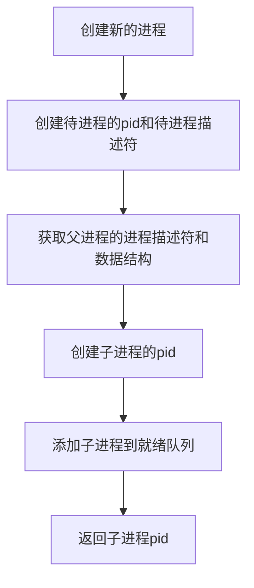

# 分析 Linux 内核创建一个新进程的过程

## 实验要求： 

1. 阅读理解 [task_struct 数据结构](https://github.com/torvalds/linux/blob/v3.18-rc6/include/linux/sched.h#L1235) ；
2. 分析 fork 函数对应的内核处理过程 sys_clone，理解创建一个新进程如何创建和修改 task_struct 数据结构；
3. 使用 gdb 跟踪分析一个 fork 系统调用内核处理函数 sys_clone ，验证您对 Linux 系统创建一个新进程的理解. 特别关注新进程是从哪里开始执行的？为什么从那里能顺利执行下去？即执行起点与内核堆栈如何保证一致。

## 阅读理解 [task_struct 数据结构](https://github.com/torvalds/linux/blob/v3.18-rc6/include/linux/sched.h#L1235) 

`struct task_struct`结构体是用于描述进程的结构体。它非常庞大，其中列举几个常用的结构体成员以及用途：

- `thread_info` 描述进程的底层信息
- `mm_struct` 指向内存区域描述符的指针
- `tty_struct` 描述进程相关的tty设备
- `pid` 是进程的标识符
- `fs_struct` 表示当前目录
-  `state` 是进程状态
- `files_struct` 指向文件描述符的指针
- `stack` 是堆栈
- `thread` 用于保存上下文中 `CPU` 相关状态信息的关键数据
- `signal_struct` 表示接收到的信号

## 分析 fork 函数对应的内核处理过程 sys_clone

对于 `RISC-V Linux` 系统来说，用户态程序执行 `ecall` 指令出发 `entry_SYSCALL64` 并以 `ret`  返回系统调用。系统调用陷入内核态，用用户态堆栈转换到内核态堆栈。

`fork` 系统调用创建了一个子进程，子进程复制了父进程中所有的信息，包括内核堆栈、进程描述符等。`fork` 系统调用在内核里面变成了父、子两个进程，父进程正常fork系统调用返回用户态，子进程也要从内核态返回用户态。

在 `RISC-V Linux` 系统中没有定义 `fork` 系统调用，只在`include/uapi/asm-generic/unistd.h`定义了 `clone` 系统调用, 对于的内核处理函数为220号系统调用 `sys_clone`。


在Linux 5.19.16中这些创建进程的系统调用都是在kernel/fork, 文件中实现的，代码如下：

```c
pid_t kernel_clone(struct kernel_clone_args *args)
{
	u64 clone_flags = args->flags;
	struct completion vfork;
	struct pid *pid;
	struct task_struct *p; //待创建进程的进程描述符
	int trace = 0;
	pid_t nr; //待创建进程的pid

	if ((args->flags & CLONE_PIDFD) &&
	    (args->flags & CLONE_PARENT_SETTID) &&
	    (args->pidfd == args->parent_tid))
		return -EINVAL;

	if (!(clone_flags & CLONE_UNTRACED)) {
		if (clone_flags & CLONE_VFORK)
			trace = PTRACE_EVENT_VFORK;
		else if (args->exit_signal != SIGCHLD)
			trace = PTRACE_EVENT_CLONE;
		else
			trace = PTRACE_EVENT_FORK;

		if (likely(!ptrace_event_enabled(current, trace)))
			trace = 0;
	}

    //复制进程描述符和执行时所需的其他数据结构
	p = copy_process(NULL, trace, NUMA_NO_NODE, args);
	add_latent_entropy();

	if (IS_ERR(p))
		return PTR_ERR(p);

	trace_sched_process_fork(current, p);

	pid = get_task_pid(p, PIDTYPE_PID);
	nr = pid_vnr(pid);

	if (clone_flags & CLONE_PARENT_SETTID)
		put_user(nr, args->parent_tid);

	if (clone_flags & CLONE_VFORK) {
		p->vfork_done = &vfork;
		init_completion(&vfork);
		get_task_struct(p);
	}

	wake_up_new_task(p);//将子进程添加到就绪队列，使之有机会被调度执行

	/* forking complete and child started to run, tell ptracer */
	if (unlikely(trace))
		ptrace_event_pid(trace, pid);

	if (clone_flags & CLONE_VFORK) {
		if (!wait_for_vfork_done(p, &vfork))
			ptrace_event_pid(PTRACE_EVENT_VFORK_DONE, pid);
	}

	put_pid(pid);
	return nr;
}


pid_t kernel_thread(int (*fn)(void *), void *arg, unsigned long flags)
{
	struct kernel_clone_args args = {
		.flags		= ((lower_32_bits(flags) | CLONE_VM |
				    CLONE_UNTRACED) & ~CSIGNAL),
		.exit_signal	= (lower_32_bits(flags) & CSIGNAL),
		.fn		= fn,
		.fn_arg		= arg,
		.kthread	= 1,
	};

	return kernel_clone(&args);
}


pid_t user_mode_thread(int (*fn)(void *), void *arg, unsigned long flags)
{
	struct kernel_clone_args args = {
		.flags		= ((lower_32_bits(flags) | CLONE_VM |
				    CLONE_UNTRACED) & ~CSIGNAL),
		.exit_signal	= (lower_32_bits(flags) & CSIGNAL),
		.fn		= fn,
		.fn_arg		= arg,
	};

	return kernel_clone(&args);
}

#ifdef __ARCH_WANT_SYS_FORK
SYSCALL_DEFINE0(fork)
{
#ifdef CONFIG_MMU
	struct kernel_clone_args args = {
		.exit_signal = SIGCHLD,
	};

	return kernel_clone(&args);
#else
	/* can not support in nommu mode */
	return -EINVAL;
#endif
}
#endif

#ifdef __ARCH_WANT_SYS_VFORK
SYSCALL_DEFINE0(vfork)
{
	struct kernel_clone_args args = {
		.flags		= CLONE_VFORK | CLONE_VM,
		.exit_signal	= SIGCHLD,
	};

	return kernel_clone(&args);
}
#endif                                     

#ifdef __ARCH_WANT_SYS_CLONE
#ifdef CONFIG_CLONE_BACKWARDS
SYSCALL_DEFINE5(clone, unsigned long, clone_flags, unsigned long, newsp,
		 int __user *, parent_tidptr,
		 unsigned long, tls,
		 int __user *, child_tidptr)
#elif defined(CONFIG_CLONE_BACKWARDS2)
```

从上面的代码可以看出，fork、vfork和clone这三个系统调用以及user_mode_thread和kernel_thread内核函数都能创建一个新的进程，而且都是通过kernel_clone这个函数来创建的，只是传递的参数不一样。

## 理解创建一个新进程如何创建和修改 task_struct 数据结构

创建一个进程是复制当前进程的信息，通过kernel_clone函数创建一个新的进程。因为父进程和子进程的绝大部分信息是一样的，除开pid的值和内核堆栈以及thread结构体变量记录进程执行上下文的CPU关键信息。

kernel_clone的代码如下:

```c
pid_t kernel_clone(struct kernel_clone_args *args)
{
	u64 clone_flags = args->flags;
	struct completion vfork;
	struct pid *pid;
	struct task_struct *p; //待创建进程的进程描述符
	int trace = 0;
	pid_t nr; //待创建进程的pid

	if ((args->flags & CLONE_PIDFD) &&
	    (args->flags & CLONE_PARENT_SETTID) &&
	    (args->pidfd == args->parent_tid))
		return -EINVAL;

	if (!(clone_flags & CLONE_UNTRACED)) {
		if (clone_flags & CLONE_VFORK)
			trace = PTRACE_EVENT_VFORK;
		else if (args->exit_signal != SIGCHLD)
			trace = PTRACE_EVENT_CLONE;
		else
			trace = PTRACE_EVENT_FORK;

		if (likely(!ptrace_event_enabled(current, trace)))
			trace = 0;
	}

    //复制进程描述符和执行时所需的其他数据结构
	p = copy_process(NULL, trace, NUMA_NO_NODE, args);
	add_latent_entropy();

	if (IS_ERR(p))
		return PTR_ERR(p);

	trace_sched_process_fork(current, p);

	pid = get_task_pid(p, PIDTYPE_PID);
	nr = pid_vnr(pid);

	if (clone_flags & CLONE_PARENT_SETTID)
		put_user(nr, args->parent_tid);

	if (clone_flags & CLONE_VFORK) {
		p->vfork_done = &vfork;
		init_completion(&vfork);
		get_task_struct(p);
	}

	wake_up_new_task(p);//将子进程添加到就绪队列，使之有机会被调度执行

	/* forking complete and child started to run, tell ptracer */
	if (unlikely(trace))
		ptrace_event_pid(trace, pid);

	if (clone_flags & CLONE_VFORK) {
		if (!wait_for_vfork_done(p, &vfork))
			ptrace_event_pid(PTRACE_EVENT_VFORK_DONE, pid);
	}

	put_pid(pid);
	return nr;
}
```

从这段代码可以看出创建一个新进程的流程如下：



而对于创建一个新进程进而修改 task_struct 数据结构的秘密就在获取父进程的进程描述符和其他数据结构的步骤之中，涉及的函数就是 `copy_process()`。限于篇幅，现在简短的讲解 `copy_process()` 的内容。

 `copy_process()` 函数主要是做了以下几件事情：

1. 复制进程描述符task_struct、创建内核堆栈
2. 复制所有的进程信息
3. 初始化子进程和thread
4. 为子进程分配新的pid
5. 增加系统中的进程数目
6. 返回被创建的子进程描述符指针

而第一件事情——复制进程描述符task_struct、创建内核堆栈，调用了 `dup_task_struct` 函数，而这个函数是实际复制进程描述符的关键函数。

##  GDB 跟踪分析sys_clone

使用 gdb 跟踪分析一个 fork 系统调用内核处理函数 sys_clone，我们在menuos中的test.c文件中的添加了ForkProcess函数，内容如下：

```c
int ForkProcess(int argc, char *argv[]){
  int pid;
  pid = fork();
  if(pid < 0){
    fprintf(stderr, "Fork Failed!");
    exit(-1);
  }
  else if (pid == 0){
    printf("This is Child Process!\n");
  }
  else {
    printf("This is Parent Process!\n");
    wait(NULL);
    printf("Child Complete!\n");
  }
```

并在main函数中添加以下语句：

```c
MenuConfig("fork-new", "fork new process", ForkProcess);
```

在menuos的目录下使用以下命令启动 `qemu` 模拟 `riscv` 架构同时启动gdbserver：

```c
./init-gdb.sh
```

新建另一个shell在menuos目录中输入以下命令，启动 `gdb-multiarch` 并加载Linux内核符号表：

```c
./start-gdb.sh
```

然后依次打入 `sys_clone` 、 `kernel_clone` 、 `dup_task_struct` 、 `copy_process` 、`copy_thread` 、 `ret_from_fork` 的断点。


从上图中可以发现 `do_fork` 这个函数的确已经在5.19.16的内核删除，并使用kernel_clone代替了。

待程序成功加载Menuos后，在MenuOS中输入 `fork-new` 使用 `ForkProcess` 函数创建新的进程。


首先启动的是__se_sys_clone,如下图所示：


然后启动的是kernel_clone：


接着是copy_process:


然后开始复制所有的进程信息


接着进入copy_thread


最后返回子进程


MenuOS上如下：


本次调试过程基本符合之前分析的步骤。
